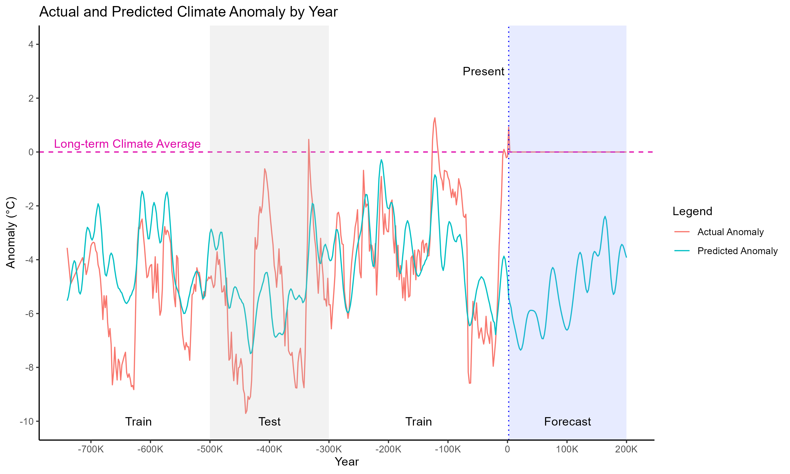
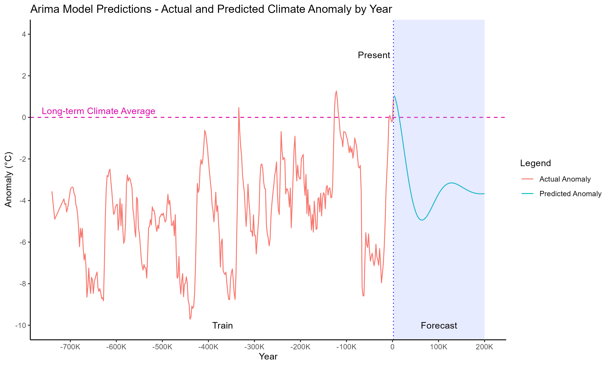

To run locally, clone the repository and perform the following:
1. Install `Python 3`, `pip`, and `R`
2. Using `pip`, set up a virtual environment and install the packages in `requirements.txt` to set up the Python environment.
3. Run `Rscript install_packages.r` to set up the R environment.
4. To run the entire pipeline, run `./src/orchestrator.bat` (Windows) or `./src/orchestrator.sh` (Linux) from the root directory of the repository. This will:
    - Pull remaining data that doesn't fit in the repository
    - Creates a local SQLite database to act as a data warehouse
    - Runs the ETL pipeline:
        - Extract Holocene to modern temperature measurements, long-term climate, CO2 and Beryllium-10 concentrations, geomagnetic field intensity, and simulated orbital parameters
        - Transform the data into a common format for analysis
        - Load the data to populate the SQLite data warehouse
    - Creates views from the data warehouse for different analyses:
        - `raw_global_anomaly_view.csv`: Full, globally aggregated data with high resolution, original units, and missing values
            - Used for visualization in original form
        - `long_term_global_anomaly_view.csv`: Globally aggregated data in the train/test/forecast window with low, even resolution, no missing values, and in standardized units
            - Used for visualization where missing values are not desired
        - `long_term_global_anomaly_view_enriched_training.csv`: Globally aggregated data in the train/test/forecast window with low, even resolution, no missing values, and in standardized units, with engineered features
            - Used for machine learning
    - Performs linear regression:
        - `linear_model`: Uses linear regression with no lagged anomaly values as context (no time series elements)
        - `linear_model_lagged`: Uses linear regression with lagged anomaly values as context (time series elements)
    - Performs ARIMA forecasting:
        - `arima_model`: Uses ARIMA, purely based on past anomaly values
        - `arimax_model`: Uses ARIMA, uses both past anomaly values and other features
5. Alternatively, use `orchestrator_no_etl` to only perform the steps after view creation, using saved ETL outputs from the repository.

Recent temperature anomaly:

Temperature anomaly since 12,000 BC:

Temperature anomaly since 800,000 BC:

Interactions between anomaly and orbital parameters:

Linear model results:

Lagged Linear model results:

ARIMA model results:

ARIMAX model results:
