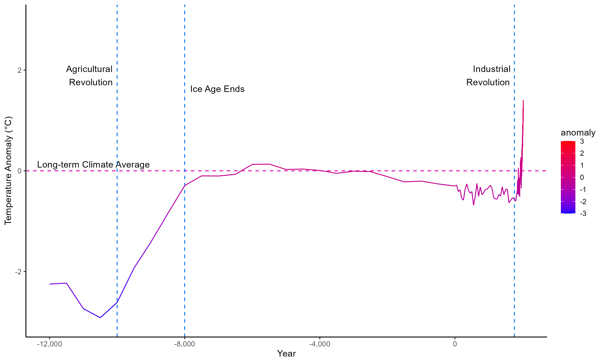
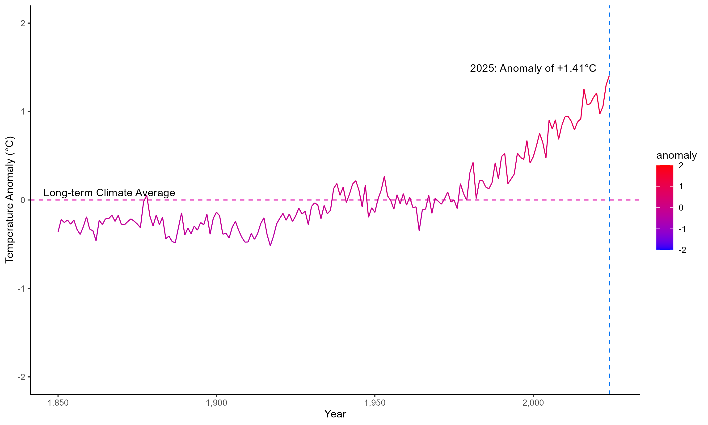

# Paleoclimate Analytics Project
 
Study on the Earth's climate in the last million years

Temperature anomaly since 1 million years ago:

Temperature anomaly since 12,000 BC:

Temperature anomaly since 1850:

