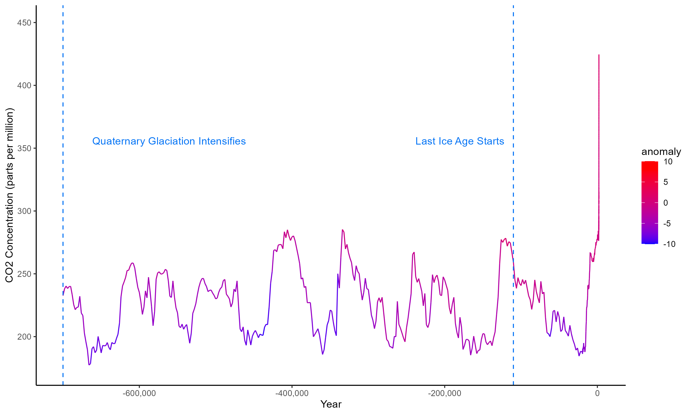

# Paleoclimate Analytics Project
 
Study on the Earth's climate in the last million years

Temperature anomaly since 1 million years ago:

Note the very similar patterns of carbon dioxide levels over the last million years:

Temperature anomaly since 12,000 BC:

Temperature anomaly since 1850:

Research AGGI Index:
https://gml.noaa.gov/aggi/aggi.html

CO2 levels in past 11,000 years dataset:
https://daac.ornl.gov/cgi-bin/dsviewer.pl?ds_id=1382

More CO2 level datasets:
https://www.ncei.noaa.gov/access/paleo-search/

Milankovitch Cycles dataset:
http://www.climatedata.info/forcing/data-downloads/

Next, incorporate Milankovitch data as well as recent GHG index data
