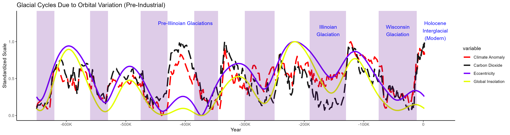

To run locally, clone the repository and perform the following:
1. Install `Python 3`, `pip`, and `R`
2. Using `pip`, set up a virtual environment and install the packages in `requirements.txt` to set up the Python environment.
3. Run `Rscript install_packages.r` to set up the R environment.
4. To run the entire pipeline, run `./src/orchestrator.bat` (Windows) or `./src/orchestrator.sh` (Linux) from the root directory of the repository. This will:
    - Pull remaining data that doesn't fit in the repository
    - Creates a local SQLite database with a star schema, acting as a data warehouse of temperature measurements with dimensions
    - Runs the ETL pipeline:
        - Extract Holocene to modern temperature measurements, long-term climate, CO2 and Beryllium-10 concentrations, geomagnetic field intensity, and simulated orbital parameters
        - Transform the data into a common format for analysis
        - Load the data to populate the SQLite data warehouse
    - Creates views from the data warehouse for different analyses:
        - `raw_global_anomaly_view.parquet`: Full, globally aggregated data with high resolution, original units, and missing values
            - Used for visualization in original form
        - `long_term_global_anomaly_view.parquet`: Globally aggregated data in the train/test/forecast window with low resolution, even frequency, no missing values, and standardized units
            - Used for visualization where missing values are not desired
        - `long_term_global_anomaly_view_enriched_training.parquet`: Globally aggregated data in the train/test/forecast window with low resolution, even frequency, no missing values, standardized units, and engineered features
            - Used for machine learning
    - Performs linear regression forecasting:
        - `linear_model`: Linear regression model with no lagged anomaly values as context (no time series elements)
        - `linear_model_lagged`: Linear regression model with lagged anomaly values as context (time series elements)
    - Performs ARIMA forecasting:
        - `arima_model`: ARIMA model purely based on past anomaly values
        - `arimax_model`: ARIMAX model using both past anomaly values and other features
    - Performs Torch neural network forecasting:
        - `torch_model`: Torch neural network with manually configured hyperparameters
        - `genetic_torch_model`: Torch neural network with hyperparameters optimized using a genetic algorithm
5. Alternatively, run `./src/orchestrator_no_etl.bat` (Windows) or `./src/orchestrator.sh` (Linux) to only perform the steps after view creation, using pre-computed ETL outputs from the repository.

Recent temperature anomaly:

Temperature anomaly since 12,000 BC:

Temperature anomaly since 800,000 BC:

Interactions between anomaly and orbital parameters:

Forecasting results by model:

Best results (genetically optimized Torch neural network model):

To do list:
Add references
Maybe refine data warehouse to avoid copying time ID, maybe ue year bin a a natural key, condense dimensions, etc.
Trace each data source to its origin, and how it might be found again
Clean up random files in the repository
For the future, the outputs of the predictions would go nicely in a BI application with a dashboard, scrolling, zooming, etc.
Try analyzing maximum resolution data near the last Yellowstone eruption

Before parquet changes, folder is 4.74 GB