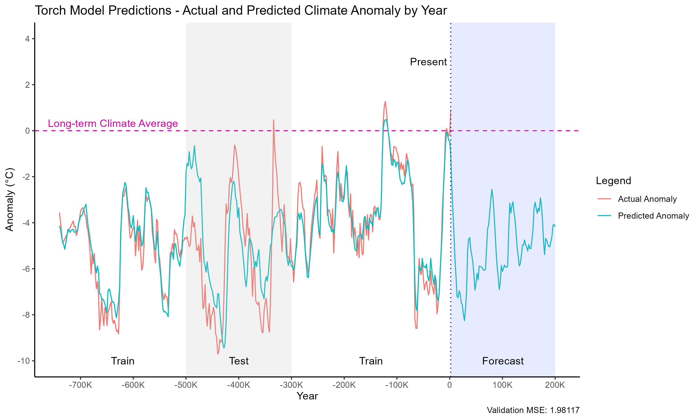

# Paleoclimate Analytics Project
 
Study on the Earth's climate in the last million years

Temperature anomaly since 1 million years ago:

Note the very similar patterns of carbon dioxide levels over the last million years:

Comparison of variations in orbital "wobble" with carbon dioxide levels and climate anomaly:

Temperature anomaly since 12,000 BC:

Temperature anomaly since 1850:

Estimated forecast of temperature anomaly:

Research AGGI Index:
https://gml.noaa.gov/aggi/aggi.html

CO2 levels in past 11,000 years dataset:
https://daac.ornl.gov/cgi-bin/dsviewer.pl?ds_id=1382

More CO2 level datasets:
https://www.ncei.noaa.gov/access/paleo-search/

Milankovitch Cycles dataset:
http://www.climatedata.info/forcing/data-downloads/

Milankovitch Simulator:
https://biocycle.atmos.colostate.edu/shiny/Milankovitch/

Modern CO2 levels dataset:
https://gml.noaa.gov/ccgg/trends/gl_data.html

2024 mean CO2 level:
https://www.statista.com/statistics/1091999/atmospheric-concentration-of-co2-historic/

Article about Milankovitch Cycles:
https://science.nasa.gov/science-research/earth-science/milankovitch-orbital-cycles-and-their-role-in-earths-climate/
    Notably, the effects of axial and apsidal precession have 23000 year cycles, and may be the cause of lots of the "noise" in the data
        May benefit from increasing data resolution to better capture such cycles

https://onlinelibrary.wiley.com/doi/full/10.1155/2014/345482?msockid=00f9caf6c69469371ab8dbfbc73c68e1
^ Notes that cosmic ray flux is a significant factor in glaciation - affects albedo from low-cloud cover
Predicting delta anomaly is important, because it is indicative of positive feedback loops in either direction - very powerful

Cosmic flux dataset search:
https://www.ncei.noaa.gov/access/paleo-search
https://www.ncei.noaa.gov/products/space-weather/legacy-data/cosmic-ray
https://www.ncei.noaa.gov/access/paleo-search/study/search.json?searchText=cosmic&dataPublisher=NOAA&headersOnly=true
https://www.sciencedirect.com/science/article/abs/pii/S0277379197000899
https://www.sciencedirect.com/science/article/abs/pii/S0277379110002118
https://www.sciencedirect.com/science/article/abs/pii/S0277379124004943

Look into magnetic data gathered by J Masarik
https://agupubs.onlinelibrary.wiley.com/doi/epdf/10.1029/1998JD200091
https://www.sciencedirect.com/science/article/pii/S0012821X02005162?via%3Dihub (sources)
https://www.sciencedirect.com/science/article/pii/S0012821X02005162?via%3Dihub
^ SINT-800 Dataset: https://doi.pangaea.de/10.1594/PANGAEA.132703
Finally found a copy of SINT-2000 from https://academic.oup.com/gji/article/231/1/520/6595302 (Linked GitHub for Data Availability, extracted data from .mat file)

Search beryllium on https://www.ncei.noaa.gov/access/paleo-search/

Beryllium-10 dataset:
https://doi.pangaea.de/10.1594/PANGAEA.743344

Possibly incorporate recent GHG index data
Attempt at least ARIMAX, Linear Regression-based, and NHITS forecasting models in different possible future scenarios
    Possibly also include a basic TensorFlow neural network and use an evolutionary algorithm for hyperparameter optimization
Also look into using smoothed variables with s() to reduce noise and for easier plotting
    s(variable) returns a smoothed version - from the mgcv package
    Try a GAM - generalized additive model, allows a linear response variable to depend linearly on predictor variables
        Simple method of time series prediction with future exogenous variables
    Try diff-based regression, using changes in each variable to predict change in anomaly, rather than absolute amounts
    Try out a gradient-boosted tree regressor and an xgboost regressor
    This guide looks very helpful for time series validation: https://towardsdatascience.com/model-validation-techniques-for-time-series-3518269bd5b3/

