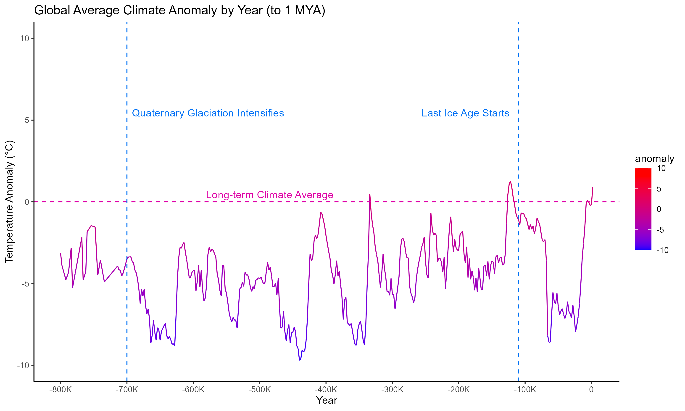
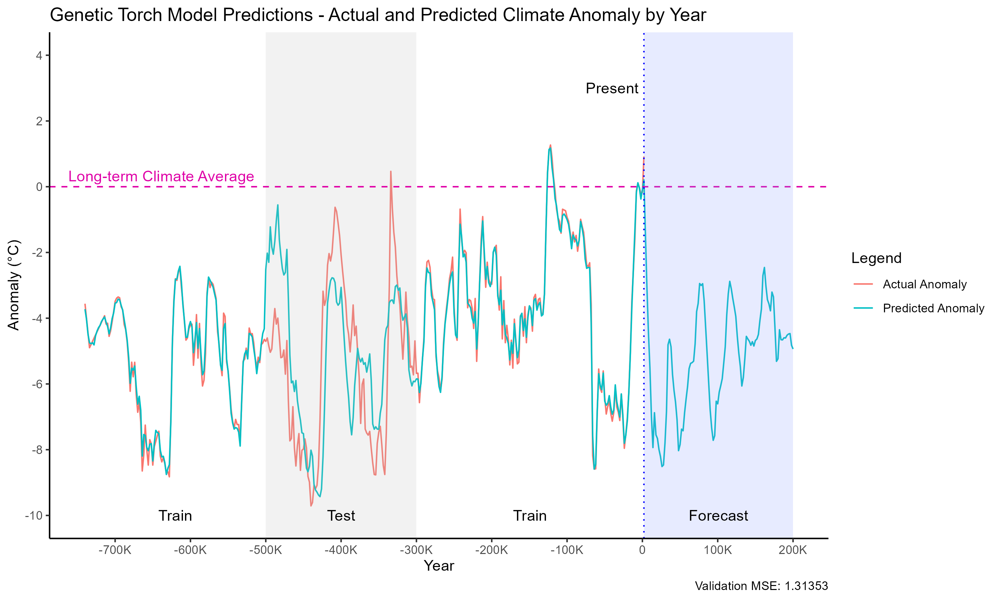

Seeking to understand, visualize, and predict long-term climate patterns, particularly ice ages, with neural networks, genetic algorithms, and classical statistical methods

To run locally, clone the repository and perform the following:
1. Install `Python 3`, `pip`, and `R`
2. Using `pip`, set up a virtual environment and install the packages in `requirements.txt` to set up the Python environment.
3. Run `Rscript install_packages.r` to set up the R environment.
4. To run the entire pipeline, run `./src/orchestrator.bat` (Windows) or `./src/orchestrator.sh` (Linux) from the root directory of the repository. This will:
    - Pull remaining data that doesn't fit in the repository
    - Creates a local SQLite database with a star schema, acting as a data warehouse of temperature measurements with dimensions
    - Runs the ETL pipeline:
        - Extract Holocene to modern temperature measurements, long-term climate, CO2 and Beryllium-10 concentrations, geomagnetic field intensity, and simulated orbital parameters
        - Transform the data into a common format for analysis
        - Load the data to populate the SQLite data warehouse
    - Creates views from the data warehouse for different analyses:
        - `raw_global_anomaly_view.parquet`: Full, globally aggregated data with high resolution, original units, and missing values
            - Used for visualization in original form
        - `long_term_global_anomaly_view.parquet`: Globally aggregated data in the train/test/forecast window with low resolution, even frequency, no missing values, and standardized units
            - Used for visualization where missing values are not desired
        - `long_term_global_anomaly_view_enriched_training.parquet`: Globally aggregated data in the train/test/forecast window with low resolution, even frequency, no missing values, standardized units, and engineered features
            - Used for machine learning
    - Performs linear regression forecasting:
        - `linear_model`: Linear regression model with no lagged anomaly values as context (no time series elements)
        - `linear_model_lagged`: Linear regression model with lagged anomaly values as context (time series elements)
    - Performs ARIMA forecasting:
        - `arima_model`: ARIMA model purely based on past anomaly values
        - `arimax_model`: ARIMAX model using both past anomaly values and other features
    - Performs Torch neural network forecasting:
        - `torch_model`: Torch neural network with manually configured hyperparameters
        - `genetic_torch_model`: Torch neural network with hyperparameters optimized using a genetic algorithm
5. Alternatively, run `./src/orchestrator_no_etl.bat` (Windows) or `./src/orchestrator.sh` (Linux) to only perform the steps after view creation, using pre-computed ETL outputs from the repository.

Recent temperature anomaly:

Temperature anomaly since 12,000 BC:

Temperature anomaly since 800,000 BC:

Interactions between anomaly and orbital parameters:

Forecasting results by model:

Best results (genetically optimized Torch neural network model):

Data sources:

Temp12k temperature proxy samples:

`Kaufman, D., McKay, N., Routson, C. et al. A global database of Holocene paleotemperature records. Sci Data 7, 115 (2020). https://doi.org/10.1038/s41597-020-0445-3`

Milankovitch simulation:

`https://biocycle.atmos.colostate.edu/shiny/Milankovitch/`

(Using calculations from `Laskar, Jacques & Robutel, P. & Joutel, Frédéric & Gastineau, Mickael & Correia, Alexandre & Levrard, B.A.. (2004). A Long-term Numerical Solution for the Insolation Quantities of the Earth. http://dx.doi.org/10.1051/0004-6361:20041335. 428. 10.1051/0004-6361:20041335. `)

Recent anomaly and long-term climate:

`https://berkeleyearth.org/data/`

Sint2000 geomagnetic field data:

`K Gwirtz, T Davis, M Morzfeld, C Constable, A Fournier, G Hulot, Can machine learning reveal precursors of reversals of the geomagnetic axial dipole field?, Geophysical Journal International, Volume 231, Issue 1, October 2022, Pages 520–535, https://doi.org/10.1093/gji/ggac195`, `https://github.com/kjg136/MLdipolePredictions`

Last glacial termination CO2 data:

`Stocker, B.D., Z. Yu, C. Massa, and F. Joos. 2017. Global Peatland Carbon Balance and Land Use Change CO2 Emissions Through the Holocene. ORNL DAAC, Oak Ridge, Tennessee, USA. https://doi.org/10.3334/ORNLDAAC/1382`

Long-term CO2 data:

`Bereiter, B.; Eggleston, S.; Schmitt, J.; Nehrbass-Ahles, C.; Stocker, T.F.; Fischer, H.; Kipfstuhl, S.; Chappellaz, J.A. (2015-02-04): NOAA/WDS Paleoclimatology - Antarctic Ice Cores Revised 800KYr CO2 Data. [indicate subset used]. NOAA National Centers for Environmental Information. https://doi.org/10.25921/n8y4-bp27.`

`Eggleston, S.; Schmitt, J.; Bereiter, B.; Schneider, R.; Fischer, H. (2016-03-28): NOAA/WDS Paleoclimatology - Antarctic Ice Core 155,000 Year CO2 and Gas Stable Isotope Data. [indicate subset used]. NOAA National Centers for Environmental Information. https://doi.org/10.25921/zckw-py79.`

`Tripati, A.K.; Roberts, C.D.; Eagle, R.A.; Li, G. (2014-03-09): NOAA/WDS Paleoclimatology - Atmospheric CO2 20 Million Year Foraminiferal B/Ca Reconstruction. [indicate subset used]. NOAA National Centers for Environmental Information. https://doi.org/10.25921/nzv2-cw49.`

`Frank, D.C.; Esper, J.; Raible, C.C.; Büntgen, U.; Trouet, V.; Stocker, T.F.; Joos, F. (2010-04-02): NOAA/WDS Paleoclimatology - 1,000 Year Ensemble Reconstructions of Temperature and CO2. [indicate subset used]. NOAA National Centers for Environmental Information. https://doi.org/10.25921/xq6s-hf81.`

Beryllium-10 data:

`Murray, R.W.; Tada, R. (2019-10-08): NOAA/WDS Paleoclimatology - East China Sea (IODP U1428, U1429) Geochemistry Data during the last 400 ka. [indicate subset used]. NOAA National Centers for Environmental Information. https://doi.org/10.25921/zsnj-v795.`

`Murray, R.W.; Tada, R. (2019-10-08): NOAA/WDS Paleoclimatology - Japan Sea (IODP U1430) Geochemistry Data through the last 12 Ma. [indicate subset used]. NOAA National Centers for Environmental Information. https://doi.org/10.25921/9z9k-ca88.`

Related papers:

`[1] Berger, A.: Milankovitch, the father of paleoclimate modeling, Clim. Past, 17, 1727–1733, 
h ps://doi.org/10.5194/cp-17-1727-2021, 2021.`

`[2] Marsh, Gerald E. "Interglacials, Milankovitch cycles, solar ac vity, and carbon 
dioxide." Journal of Climatology 2014.1 (2014): 345482. `
